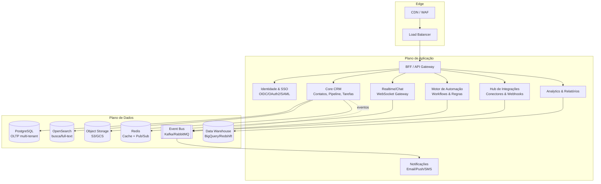
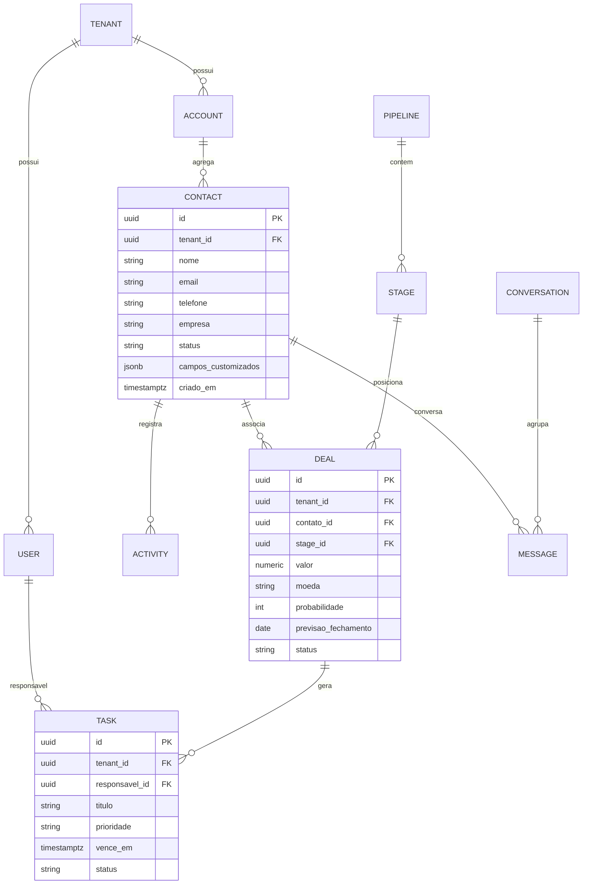

# 02 — Arquitetura Técnica

## 2.1. Estilo arquitetural

- **Frontend:** SPA/PWA (React) servido via CDN, comunicando-se com um **BFF** (Backend for
  Frontend) que agrega chamadas e adapta payloads para a UI.
- **Backend:** arquitetura **modular orientada a serviços**. Começa como um *monólito modular*
  bem fronteirado no MVP e evolui para **microsserviços** nos domínios de maior carga (Chat,
  Automação, Analytics, Integrações).
- **Comunicação:** REST/JSON e GraphQL (BFF) para requisições; **WebSockets (WSS)** para tempo
  real; **event bus** assíncrono (Kafka/RabbitMQ) entre serviços.
- **Multi-tenant:** isolamento lógico por `tenant_id` com *row-level security* no PostgreSQL.

## 2.2. Topologia de componentes

## 2.3. Domínios (DDD) e bounded contexts

| Contexto | Responsabilidade | Entidades principais |
|----------|------------------|----------------------|
| **Identidade & Acesso** | AuthN/Z, SSO, papéis, permissões | User, Role, Permission, Tenant |
| **CRM Core** | Contatos, contas, oportunidades, atividades | Contact, Account, Deal, Activity, Task |
| **Comunicação** | Chat, e-mail, notificações | Conversation, Message, Channel |
| **Automação** | Workflows, gatilhos, regras, scoring | Workflow, Trigger, Action, Rule |
| **Integrações** | Conectores externos, sincronização | Connector, SyncJob, Webhook |
| **Analytics** | KPIs, relatórios, dashboards | Metric, Report, Dashboard |

## 2.4. Modelo de dados (núcleo)

Princípios de dados:
- **UUIDs** como chaves, `tenant_id` em todas as tabelas com *row-level security*.
- **Campos customizados** em `jsonb` (com índices GIN) para personalização sem migração.
- **Soft delete** (`deleted_at`) e versionamento/auditoria via tabela de *audit log*.
- **CQRS leve** para leitura analítica: réplicas e/ou *materialized views* + Data Warehouse.

## 2.5. Tempo real (chat, presença, notificações)

- **Gateway WebSocket** com autenticação por token (JWT de curta duração).
- **Redis Pub/Sub** (ou NATS) para *fan-out* horizontal entre instâncias do gateway.
- **Garantias:** entrega *at-least-once* com idempotência por `message_id`; indicadores de
  digitação, presença e *read receipts*.
- **Escala:** *sticky sessions* opcionais + *backplane* (Redis) para múltiplos nós.

## 2.6. Automação e eventos

- Toda mudança relevante no Core publica um **evento de domínio** (`deal.stage_changed`,
  `contact.created`, `task.overdue`) no *event bus*.
- O **Motor de Automação** assina eventos e executa **workflows** (ex.: "ao mover deal para
  'Proposta', criar tarefa de follow-up em 2 dias e notificar gerente").
- Padrões: *outbox pattern* para consistência, *dead-letter queue* para falhas, *retry* com
  *backoff* exponencial.

## 2.7. API e contratos

- **API-first:** especificação **OpenAPI 3.1** versionada (`/api/v1`).
- **GraphQL** no BFF para a UI (consultas agregadas, menos *round-trips*).
- **Webhooks de saída** assinados (HMAC) para sistemas externos.
- **Rate limiting**, *pagination* (cursor-based) e *idempotency keys* em escritas.

## 2.8. Infraestrutura e implantação

- **Containers** (Docker) orquestrados por **Kubernetes**; *Helm* para releases.
- **IaC** com Terraform; ambientes `dev`/`staging`/`prod` isolados.
- **CI/CD** (GitHub Actions): build → testes → SAST/DAST → deploy *blue-green*/canário.
- **Multi-AZ** e *backups* automatizados (PITR no PostgreSQL).
- **CDN + WAF** na borda; segredos em *vault* (ex.: AWS Secrets Manager/HashiCorp Vault).

## 2.9. Observabilidade

- **Logs** estruturados (JSON) centralizados; **métricas** (Prometheus) e **tracing** distribuído
  (OpenTelemetry). Dashboards no Grafana e alertas no Alertmanager/PagerDuty. Detalhes em
  [`09-manutencao.md`](09-manutencao.md).

## 2.10. Decisões arquiteturais (ADR resumido)

| Decisão | Escolha | Motivo |
|---------|---------|--------|
| Banco principal | PostgreSQL | Relacional robusto, `jsonb`, RLS multi-tenant. |
| Tempo real | WebSocket + Redis | Maturidade, *fan-out* simples e barato. |
| Mensageria | Kafka (ou RabbitMQ) | Throughput, *replay* de eventos, *event sourcing*. |
| Frontend | React + TS | Ecossistema, produtividade, *type-safety*. |
| Estilo backend | Monólito modular → microsserviços | Reduz complexidade inicial, escala onde dói. |
