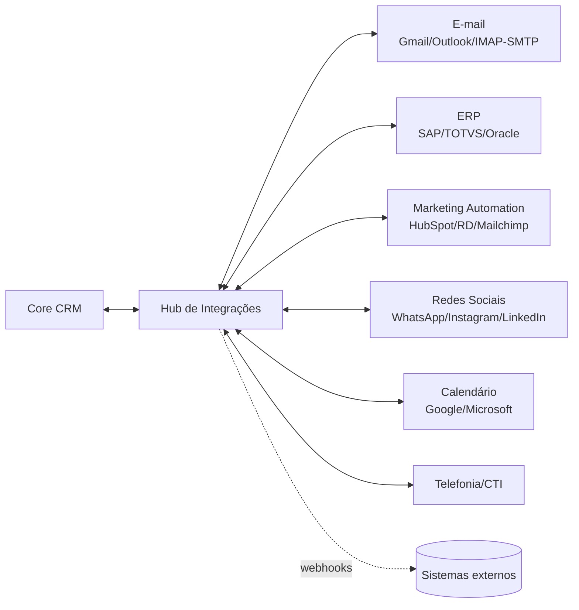

# 05 — Integrações

## 5.1. Estratégia geral

- **Hub de Integrações** centralizado: cada integração é um **conector** com configuração,
  credenciais (em *vault*), mapeamento de campos e *jobs* de sincronização.
- **Padrões:** OAuth2 para autorização, *webhooks* de entrada/saída assinados (HMAC), filas com
  *retry* e *dead-letter*, sincronização incremental (delta) e *full sync* sob demanda.
- **Observabilidade por conector:** status, última sincronização, erros e *throughput*.

## 5.2. E-mail

- **Bidirecional:** envio (SMTP/API) e recebimento (IMAP/API Gmail/Microsoft Graph).
- **Tracking** de abertura e clique (pixel + links rastreáveis, respeitando consentimento).
- **Threading** vinculado ao contato/oportunidade; *templates* e *merge fields*.
- **Cadências/sequences** de e-mail orquestradas pelo motor de automação.
- Autenticação: SPF/DKIM/DMARC para entregabilidade.

## 5.3. ERP

- Conectores para **SAP, TOTVS, Oracle, Microsoft Dynamics** (e genérico via REST/SOAP).
- Sincronização de **clientes, produtos, pedidos, faturas e estoque**.
- Fluxo típico: deal "Ganho" → cria pedido no ERP; status de faturamento volta ao CRM.
- *Mapping* configurável e resolução de conflitos (regra de prioridade por sistema-mestre).

## 5.4. Marketing Automation

- Integração com **HubSpot, RD Station, Mailchimp, Marketo**.
- Sincronização de **leads, listas, campanhas e eventos** (aberturas, cliques, conversões).
- **Lead scoring** combinando dados de marketing + comportamento no CRM.
- Disparo de campanhas a partir de workflows do CRM.

## 5.5. Redes sociais e mensageria

- **WhatsApp Business API**, **Instagram/Facebook Messenger**, **LinkedIn**.
- Mensagens entram no **chat omnichannel** e no histórico do contato.
- Publicação/monitoramento de menções (evolução) e *social listening*.

## 5.6. Calendário e reuniões

- **Google Calendar** e **Microsoft 365**: criação/atualização de eventos, *availability*,
  links de agendamento (estilo Calendly) e sincronização bidirecional.
- Integração com **Zoom/Google Meet/Teams** para reuniões com gravação anexada à interação.

## 5.7. Telefonia / CTI (evolução)

- Integração com **Twilio/Zenvia** para *click-to-call*, gravação e logging automático.

## 5.8. API pública, SDKs e Webhooks

- **REST (OpenAPI 3.1)** + **GraphQL** para parceiros e integrações sob medida.
- **Webhooks de saída** por evento (`contact.created`, `deal.won`, `message.received`).
- **SDKs** (JS/TS, Python) e coleção Postman; *sandbox* para testes.
- **App Marketplace** (evolução) para conectores de terceiros com OAuth.

## 5.9. Boas práticas de integração

| Tema | Prática |
|------|---------|
| Confiabilidade | Idempotência, *retry* com *backoff*, *dead-letter queue* |
| Segurança | Credenciais em *vault*, *scopes* mínimos, *webhooks* assinados |
| Consistência | *Outbox pattern*, sincronização incremental com *checkpoints* |
| Observabilidade | Métricas por conector, alertas de falha, *audit trail* |
| Versionamento | Versão por conector e contratos versionados |
