# 08 — Estratégia de Testes e QA

## 8.1. Pirâmide de testes

```
        /\        E2E (poucos, críticos) — Playwright/Cypress
       /  \
      /----\      Integração (APIs, DB, filas) — Supertest/Testcontainers
     /      \
    /--------\    Unitários (muitos, rápidos) — Vitest/Jest + Pytest
```

| Camada | Ferramentas | Alvo de cobertura |
|--------|-------------|-------------------|
| Unitários | Vitest/Jest, Pytest | ≥ 80% das regras de negócio |
| Integração | Supertest, Testcontainers | Endpoints, persistência, eventos |
| E2E | Playwright | Fluxos críticos (login, pipeline, chat) |
| Contrato | Pact/OpenAPI validators | Compatibilidade de APIs e webhooks |

## 8.2. Tipos de teste

- **Funcionais:** critérios de aceite (Gherkin) por feature (ver [03](03-funcionalidades.md)).
- **Regressão:** suíte automatizada executada a cada PR (CI).
- **Performance:** carga e estresse com **k6/Gatling**; metas: p95 de API < 300ms; chat com
  10k conexões simultâneas por nó (alvo de referência).
- **Tempo real:** testes de WebSocket (latência, *fan-out*, reconexão, ordenação/idempotência).
- **Segurança:** SAST (CodeQL), DAST (OWASP ZAP), SCA (Snyk/Dependabot), testes de
  autorização (anti-vazamento entre tenants) e pentests.
- **Acessibilidade:** axe-core automatizado + auditoria manual (teclado/leitor de tela).
- **Visual/regressão visual:** snapshots de UI (Playwright/Chromatic).
- **Compatibilidade:** navegadores (Chrome/Firefox/Safari/Edge) e dispositivos (responsividade).
- **Migração de dados:** validação de import/export e *backfills*.

## 8.3. Dados de teste e ambientes

- **Fixtures** e *factories* determinísticas; *seeds* por tenant.
- Ambientes: `dev` → `staging` (espelho de prod) → `prod`.
- Dados de produção **nunca** em ambientes inferiores sem anonimização.

## 8.4. Qualidade no pipeline (CI/CD)

```mermaid
flowchart LR
  PR[Pull Request] --> Lint[Lint + Typecheck]
  Lint --> Unit[Testes unitários]
  Unit --> Int[Integração]
  Int --> SAST[SAST/SCA]
  SAST --> Build[Build + Artefatos]
  Build --> E2E[E2E em staging]
  E2E --> DAST[DAST]
  DAST --> Deploy[Deploy canário/blue-green]
  Deploy --> Smoke[Smoke tests + monitor]
```



- PR bloqueado se: lint/typecheck falham, cobertura cai abaixo do limite, vulnerabilidade
  crítica detectada ou testes vermelhos.
- **Feature flags** para *dark launch* e *rollback* rápido.

## 8.5. Critérios de aceitação e DoD

**Definition of Done (DoD)**
- [ ] Código revisado e aprovado (≥ 1 revisor).
- [ ] Testes unitários/integrados adicionados e verdes.
- [ ] Critérios de aceite (Gherkin) cobertos.
- [ ] A11y e responsividade verificadas.
- [ ] Documentação/Changelog atualizados.
- [ ] Sem regressões de performance/segurança.

## 8.6. Métricas de qualidade

- Cobertura de testes, *flakiness rate*, MTTR de bugs, *escape defects* (bugs em produção),
  Core Web Vitals e taxa de erro (4xx/5xx).
