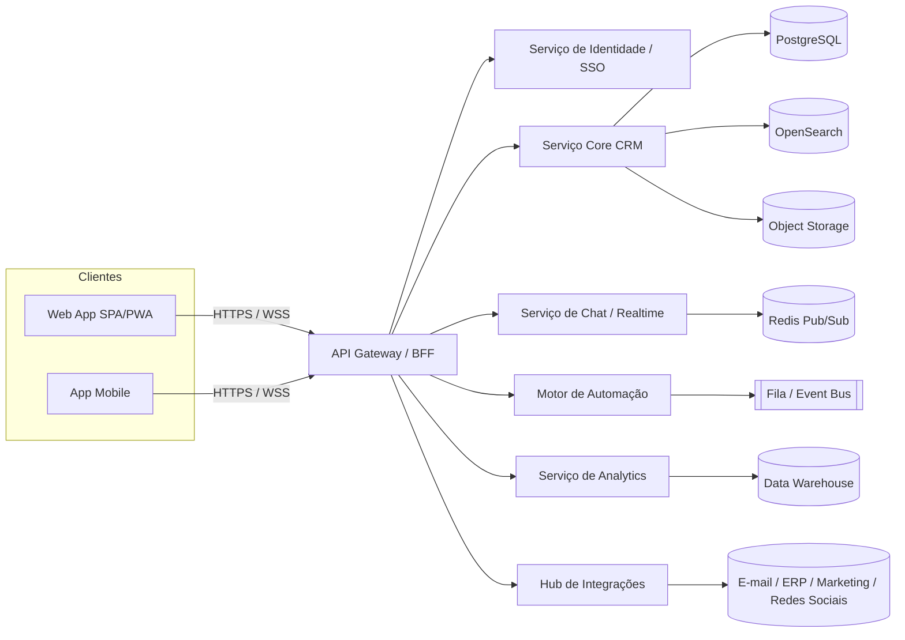

# Nexus CRM — Projeto Detalhado

> **Sumário executivo.** O Nexus CRM é uma plataforma corporativa de gestão de relacionamento
> com o cliente (CRM) concebida para empresas que precisam centralizar vendas, atendimento,
> marketing e dados de clientes em um único ambiente moderno, seguro e altamente integrado.
> O produto combina **gestão de contatos**, **pipeline de vendas**, **automação de processos**,
> **chat em tempo real**, **dashboards analíticos** e **integrações** com e-mail, ERP, ferramentas
> de marketing automation e redes sociais — tudo sob um design responsivo e acessível.

---

## 1. Objetivo deste documento

Servir como **blueprint de engenharia e produto**: descreve o *quê* (funcionalidades), o *como*
(arquitetura, stack, segurança), e o *quando* (fases, roadmap, testes e manutenção). É a fonte
única de verdade para times de Produto, Design, Engenharia, QA, Segurança e Operações.

## 2. Princípios de produto

1. **Centrado no cliente (Customer 360º).** Toda interação — e-mail, chat, ligação, compra,
   ticket — converge para uma linha do tempo única por contato/conta.
2. **Tempo real por padrão.** Atualizações de pipeline, chat e notificações são propagadas
   instantaneamente entre usuários via WebSockets.
3. **Automação como alavanca.** Regras de negócio, workflows e gatilhos reduzem trabalho manual.
4. **Aberto e integrável.** API-first; cada recurso do produto é exposto via API pública.
5. **Seguro e em conformidade.** Privacidade (LGPD/GDPR), criptografia e auditoria desde o design.
6. **Experiência impecável.** Performance, acessibilidade (WCAG 2.2 AA) e design responsável.

## 3. Visão de alto nível da arquitetura

Detalhes completos em [`02-arquitetura.md`](02-arquitetura.md).

## 4. Módulos funcionais (resumo)

| Módulo | Descrição | Documento |
|--------|-----------|-----------|
| Contatos & Contas | Cadastro 360º, deduplicação, enriquecimento, segmentação | [03](03-funcionalidades.md#1-gestão-de-contatos-e-contas) |
| Pipeline de Vendas | Funil visual (Kanban), previsão, estágios customizáveis | [03](03-funcionalidades.md#2-pipeline-de-vendas) |
| Tarefas & Lembretes | Agenda, SLA, notificações, recorrência | [03](03-funcionalidades.md#3-tarefas-lembretes-e-agenda) |
| Histórico de Interações | Linha do tempo unificada (omnichannel) | [03](03-funcionalidades.md#4-histórico-de-interações) |
| Chat em Tempo Real | Mensagens internas e omnichannel com clientes | [03](03-funcionalidades.md#5-chat-integrado-em-tempo-real) |
| Automação | Workflows, gatilhos, regras e scoring | [03](03-funcionalidades.md#6-automação-de-processos) |
| Relatórios & Dashboards | KPIs, BI self-service, exportação | [03](03-funcionalidades.md#7-relatórios-e-dashboards) |
| Personalização | Campos, layouts, permissões e temas | [03](03-funcionalidades.md#8-personalização-e-administração) |
| Integrações | E-mail, ERP, marketing, redes sociais | [05](05-integracoes.md) |

## 5. Como navegar

- **Quero entender o "porquê":** comece por [`01-visao-e-objetivos.md`](01-visao-e-objetivos.md).
- **Quero construir:** [`02-arquitetura.md`](02-arquitetura.md) +
  [`10-stack-tecnologico.md`](10-stack-tecnologico.md).
- **Quero o detalhe de cada feature:** [`03-funcionalidades.md`](03-funcionalidades.md).
- **Sou de Design:** [`04-ux-ui.md`](04-ux-ui.md).
- **Sou de Segurança/Compliance:** [`06-seguranca.md`](06-seguranca.md).
- **Quero planejar a entrega:** [`07-fases-do-projeto.md`](07-fases-do-projeto.md).

## 6. Glossário rápido

| Termo | Significado |
|-------|-------------|
| **Lead** | Contato potencial ainda não qualificado. |
| **Oportunidade / Deal** | Negócio em andamento dentro do pipeline. |
| **Pipeline** | Funil de estágios pelos quais uma oportunidade avança. |
| **BFF** | *Backend for Frontend*, camada que agrega APIs para o cliente. |
| **RBAC/ABAC** | Controle de acesso baseado em papéis/atributos. |
| **SLA** | Acordo de nível de serviço (tempo de resposta/resolução). |
| **Webhook** | Notificação HTTP enviada a sistemas externos em eventos. |
